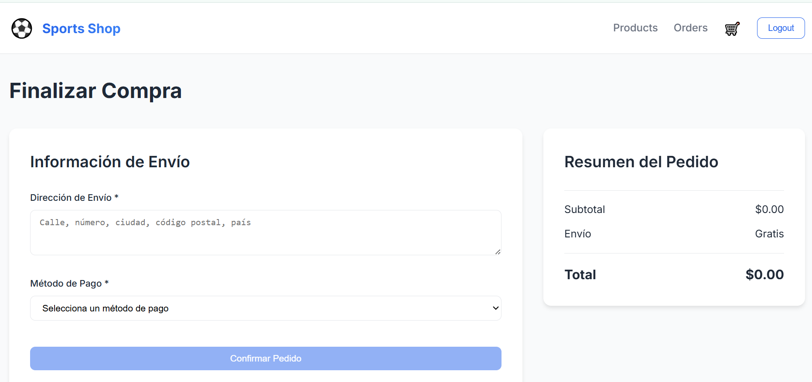
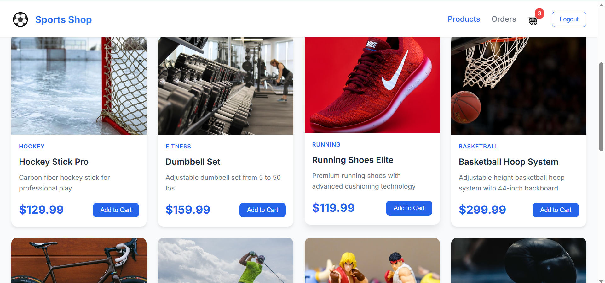
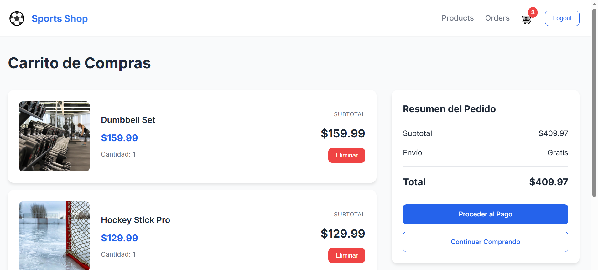

# Sports Shop - Sistema de Carrito de Compras

Sistema completo de e-commerce para artículos deportivos desarrollado con arquitectura serverless, Node.js y Vue.js 3.

## Descripción General

Esta aplicación implementa un sistema de carrito de compras completo que simula servicios AWS utilizando tecnologías locales:

- **AWS Lambda**: Simulado con Serverless Framework y serverless-offline
- **DynamoDB**: Base de datos NoSQL local
- **S3**: Simulado con MinIO para almacenamiento de imágenes
- **JWT**: Autenticación y autorización
- **Nodemailer**: Envío de correos electrónicos de confirmación

## Características Principales

### Backend

- API REST con arquitectura serverless
- Autenticación y autorización con JWT
- Validación de datos con Joi
- Logging estructurado con Winston
- Gestión de productos con paginación y filtros
- Carrito de compras por usuario
- Proceso de checkout con validación de stock
- Historial de órdenes
- Envío de emails de confirmación

### Frontend

- Single Page Application (SPA) con Vue.js 3
- Gestión de estado con Pinia
- Enrutamiento con Vue Router
- Componentes reutilizables
- Diseño responsive
- Manejo de errores y estados de carga
- Búsqueda y filtrado de productos
- Interfaz intuitiva para el carrito y checkout

## Tecnologías Utilizadas

### Backend
- Node.js v18+
- Serverless Framework v3
- AWS SDK (DynamoDB)
- serverless-offline
- JWT (jsonwebtoken)
- Winston (logging)
- Joi (validación)
- Nodemailer
- bcryptjs
- MinIO Client

### Frontend
- Vue.js 3 (Composition API)
- Vite
- Pinia (state management)
- Vue Router 4
- Axios

### Infraestructura
- Docker & Docker Compose
- DynamoDB Local
- MinIO

## Requisitos Previos

- Node.js v18 o superior
- npm v9 o superior
- Docker Desktop (recomendado para funcionalidad completa)

## Instalación y Ejecución

### Opción 1: Ejecución Automática (Recomendado)

1. Asegúrese de que Docker Desktop esté instalado y en ejecución
2. Ejecute el archivo `run.bat` desde la raíz del proyecto
3. El script instalará dependencias, iniciará servicios y poblará la base de datos automáticamente
4. Abra su navegador en http://localhost:5173

### Opción 2: Ejecución Manual

#### Paso 1: Instalar Dependencias

```bash
# Backend
cd backend
npm install

# Frontend
cd ../frontend
npm install
```

#### Paso 2: Iniciar Servicios

```bash
# Desde la raíz del proyecto
docker-compose up -d
```

Esto iniciará:
- DynamoDB Local en el puerto 8000
- MinIO en el puerto 9000 (consola en 9001) - Opcional: El proyecto usa URLs públicas para imágenes

#### Paso 3: Crear Tablas y Poblar Base de Datos

```bash
cd backend
npm run create-tables
npm run seed
```

#### Paso 4: Iniciar Backend

```bash
cd backend
npm start
```

El servidor estará disponible en http://localhost:3000

#### Paso 5: Iniciar Frontend (en otra terminal)

```bash
cd frontend
npm run dev
```

La aplicación estará disponible en http://localhost:5173

## Estructura del Proyecto

```
sports-shop/
├── backend/
│   ├── src/
│   │   ├── handlers/          # Lambda function handlers
│   │   ├── services/          # Lógica de negocio
│   │   ├── middleware/        # Middleware de autenticación
│   │   ├── models/            # Schemas de validación
│   │   ├── config/            # Configuración (DB, MinIO, Logger)
│   │   └── utils/             # Utilidades y seeds
│   ├── serverless.yml         # Configuración de Serverless
│   └── package.json
│
├── frontend/
│   ├── src/
│   │   ├── components/        # Componentes reutilizables
│   │   ├── views/             # Vistas/Páginas
│   │   ├── stores/            # Pinia stores
│   │   ├── services/          # Servicios API
│   │   └── router/            # Configuración de rutas
│   ├── vite.config.js
│   └── package.json
│
└── docker-compose.yml         # Servicios Docker
```

## Documentación de la API

La API está completamente documentada usando OpenAPI 3.0 (Swagger). El archivo de especificación se encuentra en:

```
backend/swagger.yml
```

Puede visualizar y probar la API usando herramientas como:
- [Swagger Editor](https://editor.swagger.io/) - Pegar el contenido del archivo swagger.yml
- [Swagger UI](https://swagger.io/tools/swagger-ui/) - Para visualizar la documentación
- [Postman](https://www.postman.com/) - Importar el archivo swagger.yml

## API Endpoints

### Autenticación

| Método | Endpoint | Descripción | Autenticación |
|--------|----------|-------------|---------------|
| POST | /auth/register | Registro de usuario | No |
| POST | /auth/login | Inicio de sesión | No |

### Productos

| Método | Endpoint | Descripción | Autenticación |
|--------|----------|-------------|---------------|
| GET | /products | Listar productos | No |
| GET | /products/{id} | Obtener producto | No |

Parámetros de consulta para /products:
- `page`: Número de página (default: 1)
- `limit`: Elementos por página (default: 10)
- `category`: Filtrar por categoría
- `search`: Búsqueda por texto

### Carrito

| Método | Endpoint | Descripción | Autenticación |
|--------|----------|-------------|---------------|
| GET | /cart | Obtener carrito | Sí |
| POST | /cart | Agregar producto | Sí |
| DELETE | /cart/{productId} | Eliminar producto | Sí |

### Checkout

| Método | Endpoint | Descripción | Autenticación |
|--------|----------|-------------|---------------|
| POST | /checkout | Procesar compra | Sí |

### Órdenes

| Método | Endpoint | Descripción | Autenticación |
|--------|----------|-------------|---------------|
| GET | /orders | Historial de pedidos | Sí |

## Configuración

### Variables de Entorno

#### Backend (.env)

```env
NODE_ENV=development
LOG_LEVEL=info

JWT_SECRET=your-super-secret-jwt-key-change-this

DYNAMODB_ENDPOINT=http://localhost:8000
DYNAMODB_PRODUCTS_TABLE=sports-shop-api-products-dev
DYNAMODB_USERS_TABLE=sports-shop-api-users-dev
DYNAMODB_CARTS_TABLE=sports-shop-api-carts-dev
DYNAMODB_ORDERS_TABLE=sports-shop-api-orders-dev

MINIO_ENDPOINT=localhost
MINIO_PORT=9000
MINIO_USE_SSL=false
MINIO_ACCESS_KEY=minioadmin
MINIO_SECRET_KEY=minioadmin
MINIO_BUCKET=sports-images
```

#### Frontend (.env)

```env
VITE_API_URL=http://localhost:3000
```

## Seguridad

### Implementaciones

1. **Autenticación JWT**
   - Tokens con expiración de 7 días
   - Middleware de verificación en rutas protegidas

2. **Validación de Datos**
   - Schemas Joi en todos los endpoints
   - Sanitización de inputs
   - Validación de tipos

3. **Encriptación**
   - Contraseñas hasheadas con bcryptjs
   - Salt rounds configurables

4. **Autorización**
   - Middleware que verifica tokens
   - Protección de rutas sensibles
   - Manejo apropiado de errores 401/403

5. **Validación de Stock**
   - Verificación en tiempo real durante checkout
   - Prevención de sobre-venta

## Datos de Prueba

El comando de seed crea:

- 15 productos en categorías diversas (soccer, basketball, tennis, running, yoga, boxing, swimming, cycling, golf, baseball, volleyball, fitness, skateboarding, football, hockey)
- Imágenes asociadas (MinIO o placeholders)
- Tablas de DynamoDB configuradas

## Solución de Problemas

### Error: "Cannot connect to DynamoDB"

Verifique que Docker Desktop esté ejecutándose y que los contenedores estén activos:

```bash
docker ps
```

Debería ver `sports-shop-dynamodb` y `sports-shop-minio` en la lista.

### Error: "MinIO connection refused"

Si MinIO no está disponible, la aplicación utilizará automáticamente imágenes placeholder. Para usar MinIO:

```bash
docker-compose restart minio
```

### Puerto en uso

Para Windows, identifique y cierre el proceso:

```bash
netstat -ano | findstr :3000
taskkill /PID <process_id> /F
```

### Reiniciar servicios completamente

```bash
docker-compose down -v
docker-compose up -d
cd backend
npm run seed
```

## Scripts Disponibles

### Backend

- `npm start`: Inicia serverless-offline
- `npm run create-tables`: Crea las tablas en DynamoDB
- `npm run seed`: Pobla la base de datos con productos de prueba
- `npm run clear-products`: Limpia todos los productos de la base de datos
- `npm run deploy`: Despliega a AWS (producción)

### Frontend

- `npm run dev`: Servidor de desarrollo
- `npm run build`: Build de producción
- `npm run preview`: Preview del build

## Acceso a Servicios

| Servicio | URL | Credenciales |
|----------|-----|--------------|
| Frontend | http://localhost:5173 | Usuario creado |
| Backend API | http://localhost:3000 | - |
| DynamoDB Local | http://localhost:8000 | - |
| MinIO | http://localhost:9000 | - |
| MinIO Console | http://localhost:9001 | minioadmin / minioadmin |

## Uso de la Aplicación

### Registro

1. Navegue a la aplicación
2. Haga clic en "Sign up"
3. Complete el formulario con email, contraseña, nombre y dirección opcional
4. La sesión se iniciará automáticamente

### Compra

1. Explore productos usando filtros y búsqueda
2. Agregue productos al carrito
3. Revise el carrito
4. Proceda al checkout
5. Complete la información de envío y pago
6. Confirme el pedido
7. Recibirá un email de confirmación (accesible mediante el enlace proporcionado)

### Historial

Acceda a "Orders" en el menú para ver todos sus pedidos anteriores con detalles completos.

## Criterios de Evaluación Cumplidos

### Estructura y Responsabilidades

- Separación clara entre capas (handlers, services, middleware)
- Componentes frontend modulares y reutilizables
- Configuración centralizada

### Async/Await y Manejo de Errores

- Uso consistente de async/await
- Try-catch en todas las operaciones asíncronas
- Propagación apropiada de errores
- Logging de errores con Winston

### Simulación de Servicios AWS

- Lambda simulado con serverless-offline
- DynamoDB Local para persistencia
- MinIO como alternativa a S3
- Configuración realista de IAM roles

### Calidad de Código

- Código limpio y legible
- Nombres descriptivos
- Comentarios solo donde son necesarios
- Validación exhaustiva de inputs

### Documentación

- README completo con instrucciones claras
- Ejemplos de configuración
- Guía de solución de problemas
- Documentación de API

### Seguridad

- JWT para autenticación
- Validación de schemas con Joi
- Middleware de autorización
- Encriptación de contraseñas
- Prevención de inyecciones

## Licencia

ISC

## Notas de Desarrollo

Este proyecto fue desarrollado siguiendo las mejores prácticas de arquitectura serverless y desarrollo full-stack moderno. La implementación prioriza la escalabilidad, mantenibilidad y seguridad.









